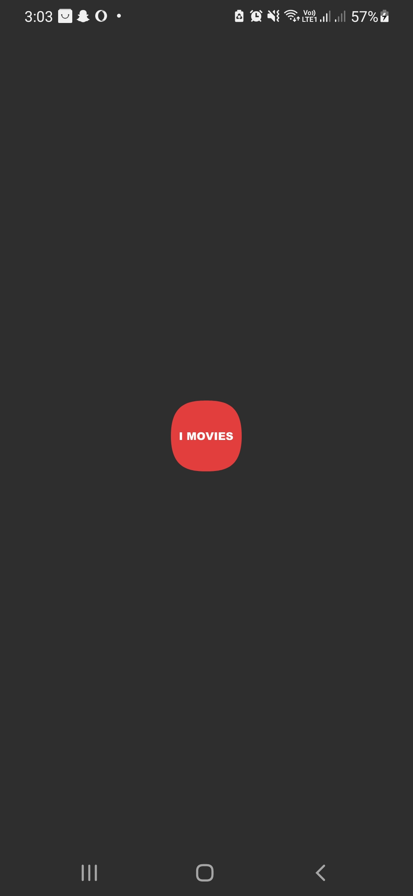
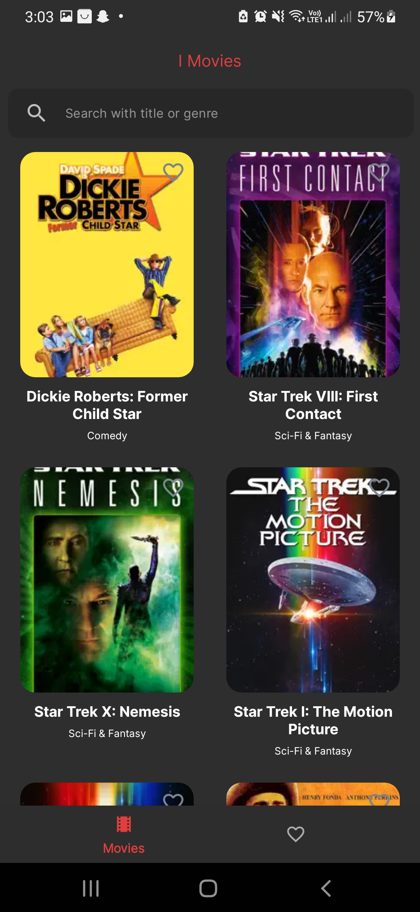
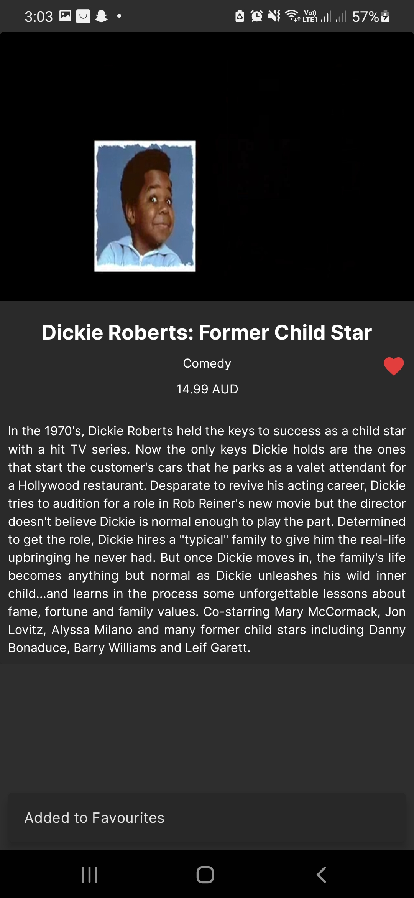
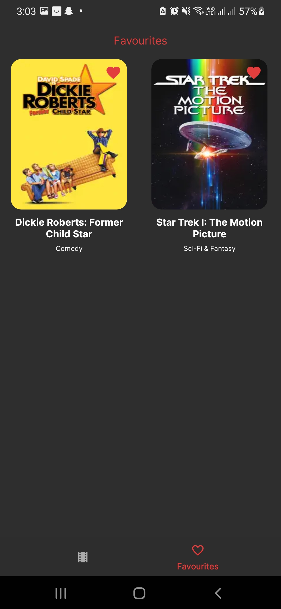
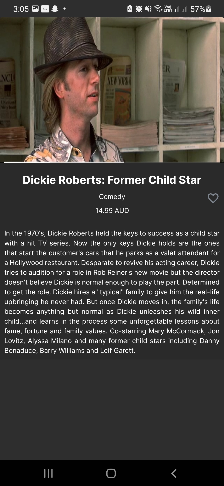
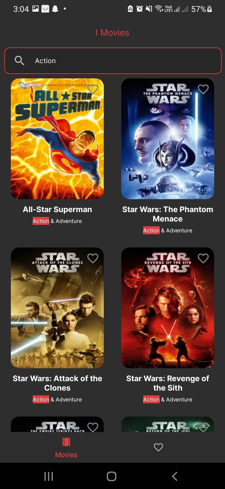

# IMovies

A sample project to demonstrate the use of MVVM architecture in Android. IMovies fetches a list of movies from an API, displays it to users, allows them to mark favorites, play trailers, and enjoy an advanced UI/UX experience.

## About IMovies

IMovies showcases:
- MVVM architecture
- Advanced UI/UX components
- Interactive features such as advanced search, marking movies as favorites and playing trailers
- Data persistence, offline support

## Tech Stack

**Core Technologies:**
- **Kotlin**
- **MVVM Architecture**
- **Kotlin Flows & State Flows**
- **Room Database**
- **Material Design 2**
- **Coil** for image loading
- **Retrofit** for network requests
- **Moshi** for JSON parsing
- **Hilt** for dependency injection
- **Jetpack Navigation Component**
- **Media3 ExoPlayer** for video playback
- **KSP** (Kotlin Symbol Processing)

**Testing Tools:**
- **JUnit4** for unit testing
- **Coroutine Testing Library** for coroutine-based code
- **Room Testing Library** for database testing
- **MockWebServer** for simulating network responses
- **MockK** for mocking
- **Robolectric** for Android component testing
- **Espresso** for UI testing
- **Jetpack Navigation Tests**

## Screenshots








## Getting Started

1. Clone the repository:
   ```bash
   git clone https://github.com/nauman-khaliq/IMovies.git

2. Open the project in Android Studio.
3. Build and run the app on your preferred device or emulator.

## Contribution
Contributions are welcome! To contribute:

1. Start by opening an issue to discuss the changes you want to make.
3. Fork the repository and create a new branch for your feature or bugfix.
3. Make your changes and submit a pull request.

Please ensure your code adheres to the project's coding standards and is well-documented.

## License
This project is licensed under the MIT License - see the LICENSE file for details.